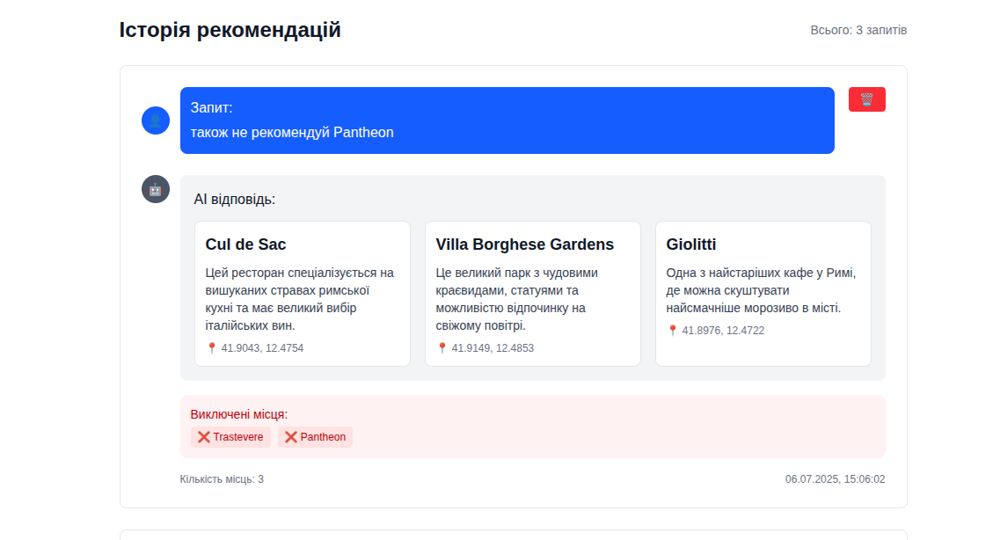

# 🗺️ Travel Recommender

AI-powered travel recommendation system with modern web interface.

## 🏗️ Architecture

- **Backend**: FastAPI + SQLAlchemy + OpenAI API
- **Frontend**: Next.js 14 + TypeScript + Tailwind CSS
- **Database**: SQLite (async with aiosqlite)
- **AI**: OpenAI GPT for intelligent recommendations

## 🚀 Quick Start

### Prerequisites
- Python 3.8+
- Node.js 18+
- OpenAI API key

### Backend Setup

```bash
cd backend
python -m venv venv
source venv/bin/activate  # On Windows: venv\Scripts\activate
pip install -r requirements.txt

# Create .env file
cp .env.example .env
# Add your OPENAI_API_KEY to .env

# Run backend
python run.py
```

Backend will be available at `http://localhost:8000`

### Frontend Setup

```bash
cd frontend
npm install
npm run dev
```

Frontend will be available at `http://localhost:3000`

## 🎯 Features

### Backend API
- 🤖 OpenAI GPT integration for intelligent recommendations
- 💬 Chat-like interaction with context memory
- 🗄️ SQLite database with async operations
- 📊 Full CRUD operations for recommendations
- 🔍 Search and statistics endpoints
- 🛡️ CORS enabled for frontend integration
- 🎯 Specific place recommendations (not just cities)

### Frontend Interface
- 💬 Modern chat-like UI with separate pages
- 🗺️ Beautiful recommendation cards
- ⚙️ Configurable number of places
- 📱 Responsive design
- 🚫 Visual exclusion tracking
- ⚡ Real-time interactions
- 📚 History page with delete functionality
- 🔄 Clear all button for chat sessions


## 📋 API Endpoints

| Method | Endpoint | Description |
|--------|----------|-------------|
| POST | `/api/v1/recommendations/` | Create new recommendation |
| GET | `/api/v1/recommendations/` | Get all recommendations |
| GET | `/api/v1/recommendations/{id}` | Get specific recommendation |
| GET | `/api/v1/recommendations/search/{query}` | Search recommendations |
| GET | `/api/v1/recommendations/stats/` | Get statistics |
| DELETE | `/api/v1/recommendations/{id}` | Delete recommendation |

## 🌐 Frontend Routes

| Route | Description |
|-------|-------------|
| `/` | Redirects to `/chat` |
| `/chat` | Chat interface with AI |
| `/history` | History of all recommendations |

## 🗂️ Project Structure

```
travel-recommender/
├── backend/
│   ├── app/
│   │   ├── api/           # API routes
│   │   ├── core/          # Configuration & database
│   │   ├── models/        # SQLAlchemy models
│   │   ├── schemas/       # Pydantic schemas
│   │   └── services/      # Business logic
│   ├── tests/             # Test suite
│   └── requirements.txt   # Python dependencies
├── frontend/
│   ├── src/
│   │   └── app/           # Next.js app directory
│   │       ├── chat/      # Chat page
│   │       ├── history/   # History page
│   │       └── components/ # React components
│   └── package.json       # Node.js dependencies
├── docs/
│   └── images/            # Screenshots and documentation
└── README.md
```

## 🧪 Testing

### Backend Tests
```bash
cd backend
python -m pytest tests/
```

### Frontend Tests
```bash
cd frontend
npm test
```

## 🔧 Configuration

### Environment Variables (Backend)
```env
OPENAI_API_KEY=your_openai_api_key
DATABASE_URL=sqlite+aiosqlite:///./travel_recommender.db
HOST=0.0.0.0
PORT=8000
```

## 🌟 Key Features

- **Intelligent Recommendations**: Uses OpenAI GPT to understand user preferences
- **Specific Places**: Recommends restaurants, attractions, neighborhoods within cities
- **Context Memory**: Remembers previous exclusions and preferences
- **Natural Language**: Users can write requests in natural language
- **Real-time Chat**: Instant responses with loading states
- **Persistent Storage**: All recommendations saved to database
- **Modern UI**: Beautiful, responsive interface
- **Full Stack**: Complete frontend + backend solution
- **History Management**: View and delete past recommendations

## 📝 Usage Examples

1. **Initial Request**: "Хочу в Рим, люблю історію та макарони"
   - AI recommends: Specific restaurants, monuments, neighborhoods in Rome

2. **Follow-up**: "Виключи Колізей, хочу щось менш туристичне"
   - AI maintains Rome context, excludes Colosseum, suggests local spots

The system automatically maintains context and provides personalized recommendations!

## 🚀 Deployment

### Backend Deployment
```bash
cd backend
pip install -r requirements.txt
python run.py
```

### Frontend Deployment
```bash
cd frontend
npm run build
npm start
```

## 🤝 Contributing

1. Fork the repository
2. Create a feature branch
3. Make your changes
4. Add tests
5. Submit a pull request

## 📄 License

MIT License - see LICENSE file for details. 


## 📸 Screenshots

### Interface



